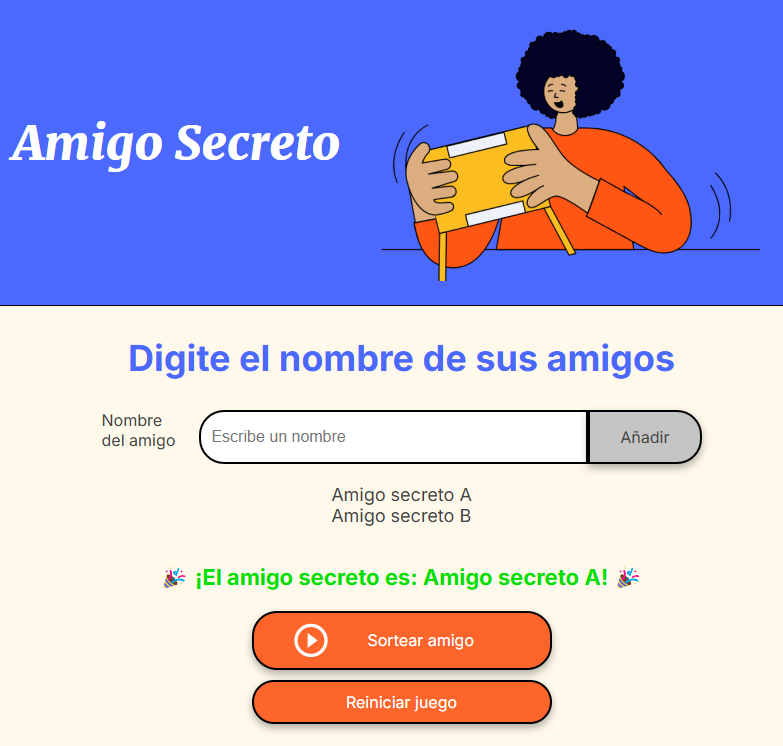

# 🎁 Challenge Amigo Secreto

Este proyecto es una aplicación web simple para realizar sorteos de "Amigo Secreto". Permite ingresar nombres de amigos, sortear de manera aleatoria y reiniciar el juego fácilmente.

## 🚀 Tecnologías utilizadas

- **HTML**: Estructura de la página.
- **CSS**: Estilos y diseño responsivo.
- **JavaScript**: Lógica del sorteo y manipulación del DOM.

## 📌 Características

- Agregar nombres a una lista.
- Validación de nombres para evitar caracteres inválidos.
- Realizar un sorteo aleatorio con los nombres ingresados.
- Mostrar el resultado del sorteo de manera interactiva.
- Reiniciar la lista para un nuevo sorteo.

## 📷 Captura de pantalla

## 📂 Estructura del proyecto

challenge-amigo-secreto/
├── index.html    # Página principal
├── style.css     # Estilos y diseño
├── app.js        # Lógica del sorteo
└── assets/       # Imágenes y recursos

## 🛠 Instalación y uso

### Requisitos

- Navegador web moderno (Chrome, Firefox, Edge, etc.)

### Instrucciones

1. Clona este repositorio:
    git clone https://github.com/GustavoVasquezS/challenge-amigo-secreto.git

2. Navega al directorio del proyecto:

    cd challenge-amigo-secreto

3. Abre el archivo index.html en tu navegador web.

## 📜 Licencia

Este proyecto está bajo la licencia MIT.

¡Diviértete sorteando tu Amigo Secreto! 🎉

